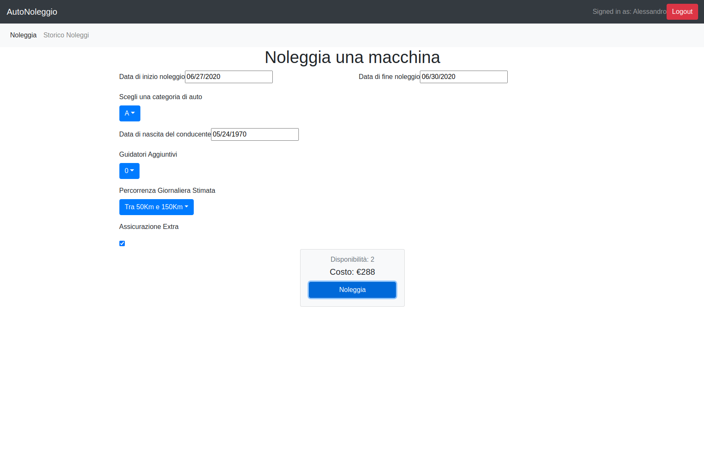

# Exam #12345: "Noleggio Auto"
## Student: 279321 FANTINI GABRIELE

## React client application routes

- Route `/`: pagina iniziale, mostra le auto trattate dall'autonoleggio. È possibile filtrare le macchine per categoria o marca di appartenenza mediante gli appositi filtri.
- Route `/login`: pagina di autenticazione.
- Route `/user`: pagina dalla quale l'utente può configurare un nuovo noleggio (visualizzando dinamicamente il preventivo) ed eventualmente confermarlo e pagarlo.
- Route `/user/history`: pagina che permette all'utente di vedere i noleggi effettuati e, se non in corso,      rimuoverli

## REST API server

- POST `/api/login`
  - request parameters:
  - request body content: {username: String, password: String}
  - response body content: {id: Number, name: String}
- POST `/api/logout`
  - request parameters:
  - request body content: 
  - response body content: 
- GET `/api/cars/public`
  - request parameters:
  - request body content: 
  - response body content: [{id: Number, name: String, brand: String, category: String}]

##### API che richiedono l'autenticazione dell'utente

- GET `/api/user`
  - request parameters:
  - request body content: 
  - response body content: {id: Number, username: String}
- GET `/api/rentsHistory`
  - request parameters:
  - request body content: 
  - response body content: [{id: Number, userId: Number, carId: Number, startDate: Date, endDate: Date, coast: Number}]
- GET `/api/rentProposal/`
  - request parameters: `<startDate>/<endDate>/<category>/<driverAge>/<additionalDrivers>/<dailyKm>/<extraInsurance>`
  - request body content: 
  - response body content: {startDate: Date, endDate: Date, coast: Number, availability: Number, category: String} 
- POST `/api/payments`
  - request parameters:
  - request body content: {
    cardHolder: String,
    cardNumber: Number,
    cardCvv: Number,
    rentProposal: {
      startDate: Date,
      endDate: Date, 
      availability: Number,
      category: String,
      coast: Number
    }
  }
  - response body content: {"id" : id, "msg" : "Rent created"}
- DELETE `/api/rents/`
  - request parameters: `<rentId>`
  - request body content: 
  - response body content: 

## Server database

- Table `User` - contains id username hash
- Table `Rent` - contains id userId carId startDate endDate coast
- Table `Car`  - contains id name brand category

## Main React Components

- `App` (in `App.js`): 
  - Definisce le Routes principali.
  - Immette le categorie e i brand trattati nei componenti Home e User.
- `Home` (in `Home.js`): 
  - Contiene la logica dei filtri e il loro stato: richiede al server la flotta di macchine presenti e le mostra in base ai filtri attivi.
  - Le macchine che intende mostrare sono passate al componente List.
- `MainFilter` (in `Home.js`):
  - Crea e gestisce un "SecondaryFilter" per ogni elemento passatogli.
- `SecondaryFilter` (in `Home.js`):
  - Componente rappresentante un filtro, con titolo e checkbox.
- `Login` (in `Login.js`):
  - Gestisce l'autenticazione dell'utente: se questo non è autenticato mostra il componente "Login Form" e si occupa di inviare i dati raccolti al server; se invece è autenticato reindirizza alla pagina "/user";
- `LoginForm` (in `Login.js`):
  - Form per la raccolta dell'usurname e della password.
- `NavBar` (in `NavBar.js`):
  - Una semplice barra di navigazione. Permette di navigare dalla Home alla pagina di Login ( e viceversa ) oppure, se autenticati, di eseguire il logout.
- `Payment` (in `Payment.js`):
  - Componente per la gestione del pagamento di una rentProposal. Fornisce un bottone che si attiva quando gli viene passato un costo non nullo. Tale bottone se cliccato apre un modal con il form per inserire i dati di pagamento. Una volta inseriti si può confermare e pagare.
- `List` (in `List.js`):
  - Per ogni elemento passatogli crea dei ListElement contenti a loro volta una "Card" con nome e marca della vettura passatagli.
- `SecondaryWindow` (in `SecondaryWindow.js`):
  - Componente di utilità per il layout. Crea un Container con in alto un titolo.
- `User` (in `User.js`):
  - Verifica se l'utente è autenticato prima di farlo accedere a delle routes secondarie. Se non lo è lo reindirizza alla pagina /login.
  - Definisce due Routes secondarie: user/ e user/history
- `UserRent` (in `UserRent.js`):
  - Gestisce la configurazione del preventivo per un noleggio. Contiene al suo interno il componente RentForm.
  - Contiene il componente Payment al quale passa la rentProposal ricevuta dal Server.
- `RentForm` (in `User.js`):
  - From per la configurazione di un noleggio.
- `UserRentHistory` (in `UserHistory.js`):
  - Componente che mostra una lista di tutti i noleggi effettutati ed eventualmente permette di annullarli.
- `HistoryList` (in `UserHistory.js`):
  - Componente che riceve una lista di noleggi e per ognuno crea un componente elemento (riga della tabella), ciascuno contenente data di inizio, di fine, costo e bottone per annullare il noleggio se possibile (il noleggio non è ancora iniziato);

## Screenshot

## Test users

* Gabriele, test
* Laila, passwordSicura
* Giorgio, passwordBella (frequent customer)
* Lorenzo, nonsochemettere2
* Alessandro, allegro01 (frequent customer)
